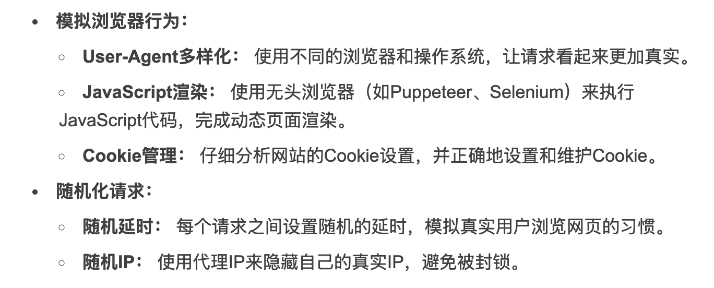

# JobSpider
爬取主流招聘网站职位，并进行数据分析与词云生成

# Liz记录
## 初始化操作
### Step1:启动proxy_pool项目

### Step2:初始化JobSpider项目
```
# 创建虚拟环境
python -m venv venv

# 激活虚拟环境
source venv/bin/activate

# 安装依赖包  经验：直接执行启动命令，缺什么包补什么包
pip install selenium requests bs4 pandas wordcloud

# 生成requirements.txt文件
pip freeze > requirements.txt

# 启动调度程序
python Main.py
```

## 日常操作
### Step1:启动proxy_pool项目

### Step2:启动JobSpider项目
```
# 激活虚拟环境
source venv/bin/activate

# 启动程序
python Main.py
```
### 注意事项
目前爬取完成的很好，用大模型进行数据分析还没有做

## 自动爬虫行为模拟

自动爬虫行为模拟：https://juejin.cn/post/7289336347642331199

这三个技巧也需要掌握，一定要有
模拟人类进行随机输入、滚动、点击页面

不然爬虫行为特征太明显，这几个都是基础

